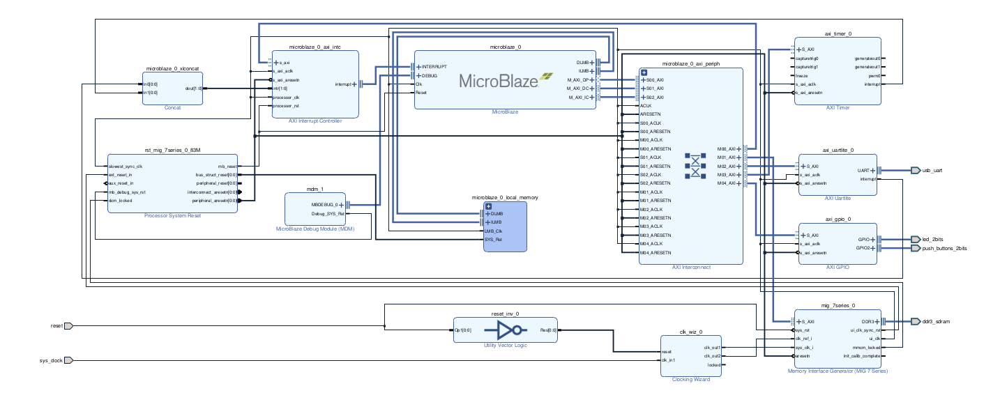

# QMTECH_XC7A100T_Wukong_Board
Board definition files and initial example programs

[Github Link](https://github.com/DavidJRichards/QMTECH_XC7A100T_Wukong_Board)

2nd revision board, original data from [https://github.com/ChinaQMTECH/XC7A100T-200T_Wukong_Board](https://github.com/ChinaQMTECH/XC7A100T-200T_Wukong_Board)

## Hardware

[Manual](./Documents/QMTECH_Artix-7_XC7A100T_Wukong_Board_V2_User_Manual(Hardware)_V01.pdf)

[Schematic](./Documents/QMTECH-XC7A100T_200T-Wukong-Board-V02-20210426.pdf)

## board definition

A set of board definition files are available which enable board automation. a tcl script to recreate an semi automated design are here:

[block design](./Tests/Test10_BD)

## Connections

### Pmod A (Corner, J10)

|     |     |     |     |     |     |
|-----|-----|-----|-----|-----|-----|
|6|5|4|3|2|1|
|3V3|Gnd|G8|G7|G5|D5|
|3V3|Gnd|G6|D6|E6|E5|
|12|11|10|9|8|7|

#### PS/2 keyboard on pmod a bottom row

|     |     |     |     |     |     |
|-----|-----|-----|-----|-----|-----|
|12|11|10|9|8|7|
|3V3|Gnd|G6|D6|n/c|n/c|
|Vcc|Gnd|Data|Clock|
|Mauve|Blue|Grey|White|||
|1|2|3|4|||

### Pmod B (Middle, J11)

|     |     |     |     |     |     |
|-----|-----|-----|-----|-----|-----|
|6|5|4|3|2|1|
|3V3|Gnd|A5|A4|F4|H4|
|3V3|Gnd|B5|B4|G4|J4|
|12|11|10|9|8|7|

### Camera

|     |     |     |     |     |     |     |     |     |
|-----|-----|-----|-----|-----|-----|-----|-----|-----|
|1|3|5|7|9|11|13|15|17|
|3V3|H21|K21|H26|G25|G20|F23|E26|E25|
|Gnd|H22|J21|G26|F25|G21|E23|D26|D25|
|2|4|6|8|!0|12|14|16|18|

#### Camera add-on board (ebaz version)

|     |     |     |     |     |     |     |     |     |
|-----|-----|-----|-----|-----|-----|-----|-----|-----|
|1|3|5|7|9|11|13|15|17|
|3V3|SCL|VS|PLK|D7|D5|D3|D1|RST|
|Gnd|SDA|HS|XLK|D6|D4|D2|D0|PWDN|
|2|4|6|8|!0|12|14|16|18|

#### Micro SD add-on connections

|     |     |     |     |     |     |
|-----|-----|-----|-----|-----|-----|
|3V3|Gnd|SCLK|CS|MOSI|MISO|
|3V3|Gnd|H21|H22|H26|G26|

#### single pmod connections

|     |     |     |     |     |     |
|-----|-----|-----|-----|-----|-----|
|6|5|4|3|2|1|
|3V3|Gnd|G26|H26|H22|H21|

#### double pmod connections

|     |     |     |     |     |     |
|-----|-----|-----|-----|-----|-----|
|6|5|4|3|2|1|
|3V3|Gnd|F23|E23|E26|D26|
|3V3|Gnd|G25|F25|G20|G21|
|12|11|10|9|8|7|

#### led & Button
 * G25

#### unused
 * 7-H26
 * 8-G26
 * 18-D25

### Qmtech demos

[Test01_led_key](./Tests/Test01_led_key)

[Test04-DDR3_MIG](./Tests/Test04-DDR3_MIG)

[Test05_usb_uart_cp2102](./Tests/Test05_usb_uart_cp2102)

[Test06_HDMI_OUT](./Tests/Test06_HDMI_OUT)

[Test08_GMII_Ethernet](./Tests/Test08_GMII_Ethernet)

### Mandelbrot demo

[FPGA-Mandelbrot](https://github.com/DavidJRichards/FPGA-Mandelbrot)

### Board automation demo
[Artix-7 Arty Base Project](https://www.fpgadeveloper.com/2017/11/artix-7-arty-base-project.html/)

[Video 1](https://www.youtube.com/watch?v=GyFTMwBjyOY&t=9s)

[Video 2](https://www.youtube.com/watch?v=8lrA5vrWgfo&t=4s)

### verilog-ethernet

[Doxygen](http://djrm.netmx.co.uk/ebaz4205/verilog-ethernet/md_example_Wukong_fpga_README.html)

[Github](https://github.com/DavidJRichards/verilog-ethernet/tree/master/example/Wukong/fpga)

### Xilinx & RTL8211EG example

[TCP/IP stack in SystemVerilog by hypernyan](https://www.librecores.org/hypernyan/ethvlg)

[a TCP stack document](http://csg.csail.mit.edu/6.375/6_375_2019_www/handouts/finals/Group_7_report.pdf)

[a TCP stack implementation](https://github.com/DavidJRichards/verilog-ethernet/tree/master/example/Wukong/fpga#readme)

[RTL8211EG data](./Documents/rtl8211e-g-vb-vl-cg_datasheet_1-045de.pdf)

[Gigabit ethernet 1](https://blog.csdn.net/weixin_43824941/article/details/108306872)

[Gigabit ethernet 2](https://blog.csdn.net/weixin_43824941/article/details/108312347)

Board definition used to create block design for hardware export to Vitis.

