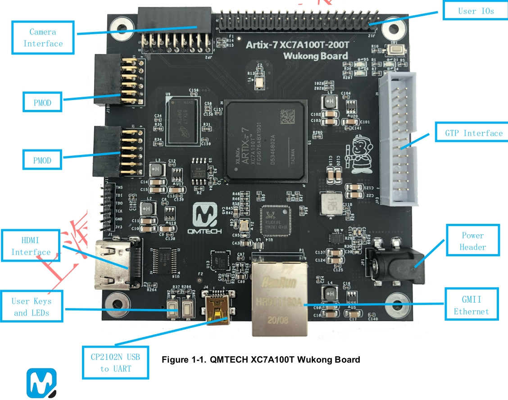

# QMTECH_XC7A100T_Wukong_Board
Board definition files and initial example programs

2nd revision board, original data from https://github.com/ChinaQMTECH/XC7A100T-200T_Wukong_Board

Board definition files not yet working except for simple outline with part number.

## Connections

### Pmod A
|     |     |     |     |     |     |
|-----|-----|-----|-----|-----|-----|
|3V3|Gnd|G8|G7|G5|D5|
|3V3|Gnd|G6|D6|E6|E5|

### Pmod B

|     |     |     |     |     |     |
|-----|-----|-----|-----|-----|-----|
|3V3|Gnd|A5|A4|F4|H4|
|3V3|Gnd|B5|B4|G4|J4|

### Camera

|     |     |     |     |     |     |     |     |     |
|-----|-----|-----|-----|-----|-----|-----|-----|-----|
|3V3|H21|K21|H26|G25|G20|F23|E26|E25|
|Gnd|H22|J21|G26|F25|G21|E23|D26|D25|

### Board automation demo
https://www.fpgadeveloper.com/2017/11/artix-7-arty-base-project.html/
https://www.youtube.com/watch?v=GyFTMwBjyOY&t=9s
https://www.youtube.com/watch?v=8lrA5vrWgfo&t=4s

### Xilinx & RTL8211EG example
https://blog.csdn.net/weixin_43824941/article/details/108306872
https://blog.csdn.net/weixin_43824941/article/details/108312347
